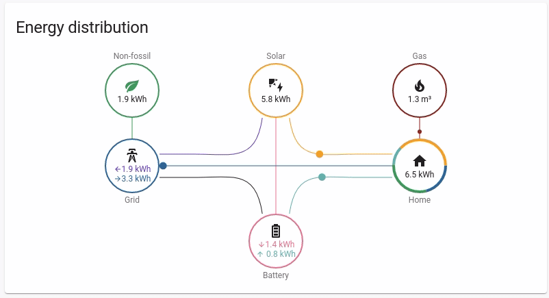

# MySMAReader
SMA Solar Inverter addon for Home Assistant

> This addon will connect directly to your Inverter using Modbus TCP.

## Support models
**The Inverter must be accessible on the network using TCP.**

modbus-SMA

## Installation
1. Navigate in your Home Assistant frontend to Supervisor -> Add-on Store.
2. Click the 3-dots menu at upper right ... -> Repositories and add [https://github.com/karelvdvd/MySMAReader]
3. Install MySMAReader Addon
4. Configure and Start it

